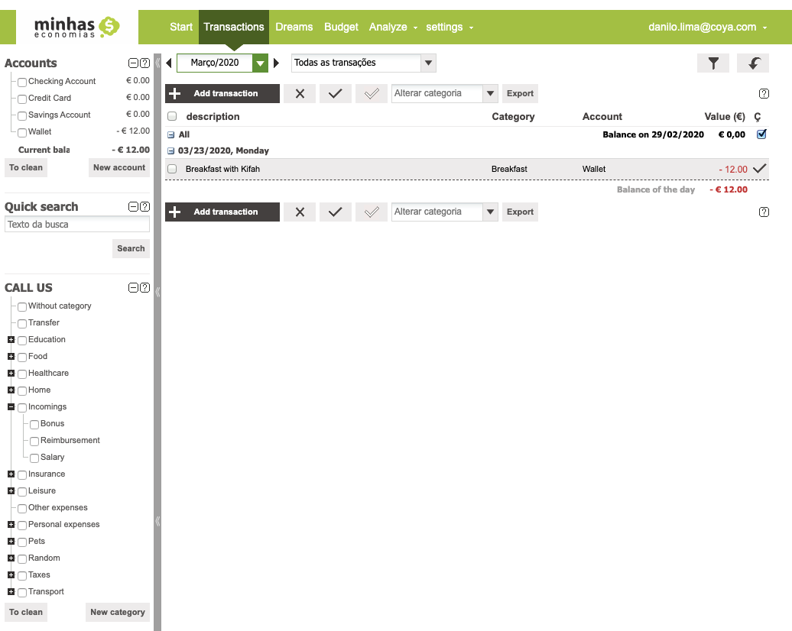

# React Training

### The project
We are implementing the interface for the finance project:

### Reference
- 
- Link: https://wwws.minhaseconomias.com.br/
- login: danilo.lima@coya.com
- pw: paranaue123

### Run dev env

- Clone this repo

- Navigate to project directory and install modules
`yarn install`

- Run development environment
`yarn start`

- Open browser `localhose:3000`

### What we will build

We will going to build a prototype of personal finance app like in http://www.minhaseconomias.com.br/

#### Main entities:

Account: `name, id`

Category: `name, id, parentCategory`

Transaction: `date, description, type [depit | expense | transfer], account, category, amount`

### Tech Stack:

- React using Typescript

- State manager: React context

- Routing: React router

- UI: UIMateriall

- Visualization: D3

### Design:

same as in http://www.minhaseconomias.com.br/

#### Main views:

- DataTable for the transactions
- Category list with filter options
- Account list with filter options

*We will mock the data for now.*

### ToDos: (Can be modified/extended)

- [x] Create BankAccount list component
- [ ] Add test @kifah

- [ ] Create master layout

- [ ] Create Category type and add it to the global state

- [ ] Create Category list component

- [ ] Create Transaction type and add it to global state

- [ ] Create Main transaction table (Just to display)

- [ ] Add new Category/Account

- [ ] Delete Category/Account

- [ ] Update Category/Account

- [ ] Add new Transaction

- [ ] Update and delete Transaction

- [ ] Add filter function to the data table

- [ ] tbd

